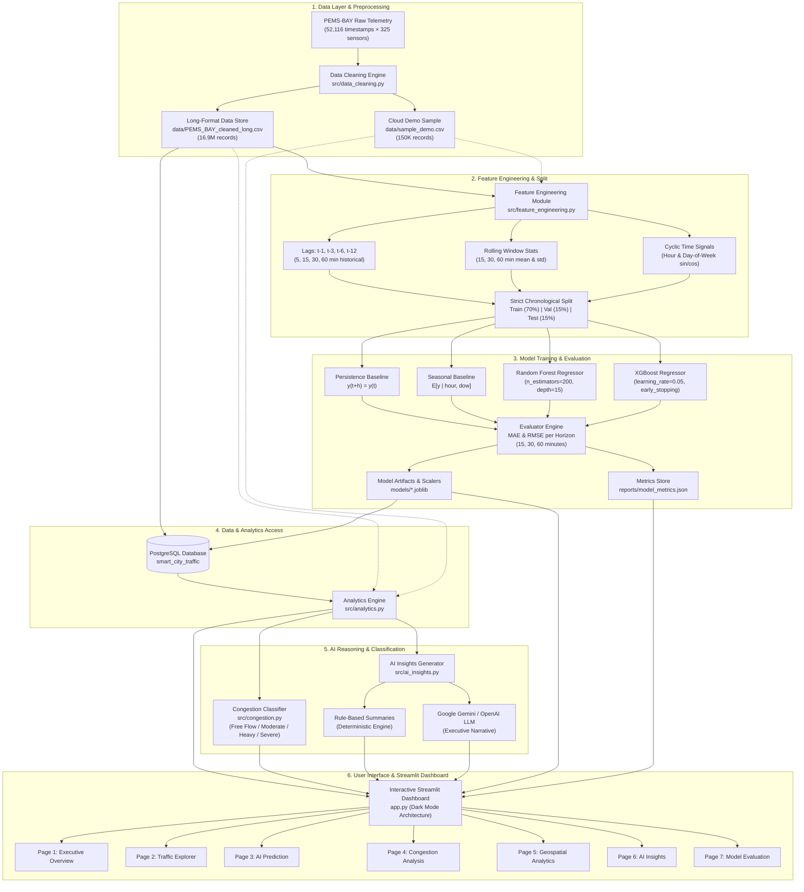

# System Architecture Diagram
## Smart City Traffic Analytics & AI-Based Congestion Prediction System

```mermaid
flowchart TD
    subgraph DataIngestion ["1. Data Layer & Preprocessing"]
        A["PEMS-BAY Raw Telemetry<br/>(52,116 timestamps × 325 sensors)"] --> B["Data Cleaning Engine<br/>src/data_cleaning.py"]
        B --> C["Long-Format Data Store<br/>data/PEMS_BAY_cleaned_long.csv<br/>(16.9M records)"]
        B --> C2["Cloud Demo Sample<br/>data/sample_demo.csv<br/>(150K records)"]
    end

    subgraph FeaturePipeline ["2. Feature Engineering & Split"]
        C --> D["Feature Engineering Module<br/>src/feature_engineering.py"]
        C2 -.-> D
        D --> D1["Lags: t-1, t-3, t-6, t-12<br/>(5, 15, 30, 60 min historical)"]
        D --> D2["Rolling Window Stats<br/>(15, 30, 60 min mean & std)"]
        D --> D3["Cyclic Time Signals<br/>(Hour & Day-of-Week sin/cos)"]
        D1 & D2 & D3 --> E["Strict Chronological Split<br/>Train (70%) | Val (15%) | Test (15%)"]
    end

    subgraph ModelingEngine ["3. Model Training & Evaluation"]
        E --> F1["Persistence Baseline<br/>y(t+h) = y(t)"]
        E --> F2["Seasonal Baseline<br/>E[y | hour, dow]"]
        E --> F3["Random Forest Regressor<br/>(n_estimators=200, depth=15)"]
        E --> F4["XGBoost Regressor<br/>(learning_rate=0.05, early_stopping)"]
        F1 & F2 & F3 & F4 --> G["Evaluator Engine<br/>MAE & RMSE per Horizon<br/>(15, 30, 60 minutes)"]
        G --> H["Model Artifacts & Scalers<br/>models/*.joblib"]
        G --> I["Metrics Store<br/>reports/model_metrics.json"]
    end

    subgraph PersistenceLayer ["4. Data & Analytics Access"]
        C --> J[("PostgreSQL Database<br/>smart_city_traffic")]
        H --> J
        J --> K["Analytics Engine<br/>src/analytics.py"]
        C -.-> K
        C2 -.-> K
    end

    subgraph IntelligenceLayer ["5. AI Reasoning & Classification"]
        K --> L["Congestion Classifier<br/>src/congestion.py<br/>(Free Flow / Moderate / Heavy / Severe)"]
        K --> M["AI Insights Generator<br/>src/ai_insights.py"]
        M --> M1["Rule-Based Summaries<br/>(Deterministic Engine)"]
        M --> M2["Google Gemini / OpenAI LLM<br/>(Executive Narrative)"]
    end

    subgraph PresentationLayer ["6. User Interface & Streamlit Dashboard"]
        K & L & M1 & M2 & H & I --> UI["Interactive Streamlit Dashboard<br/>app.py (Dark Mode Architecture)"]
        UI --> P1["Page 1: Executive Overview"]
        UI --> P2["Page 2: Traffic Explorer"]
        UI --> P3["Page 3: AI Prediction"]
        UI --> P4["Page 4: Congestion Analysis"]
        UI --> P5["Page 5: Geospatial Analytics"]
        UI --> P6["Page 6: AI Insights"]
        UI --> P7["Page 7: Model Evaluation"]
    end
```
